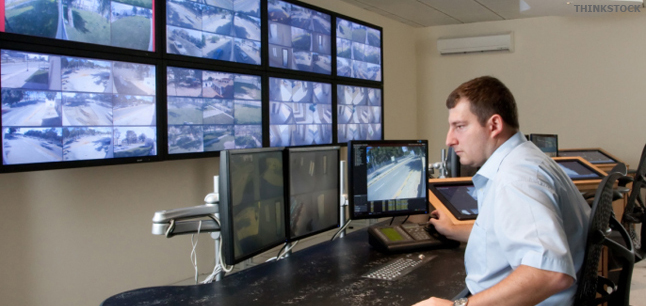
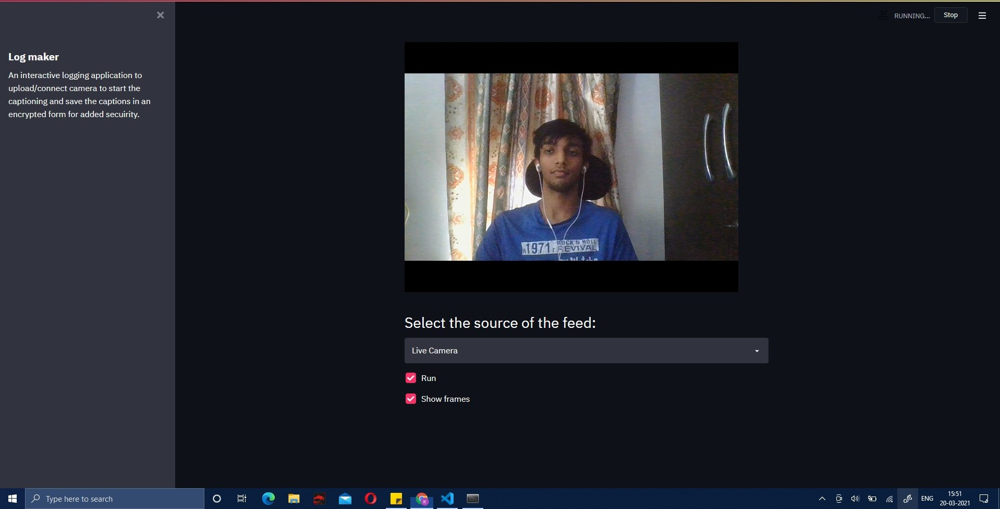
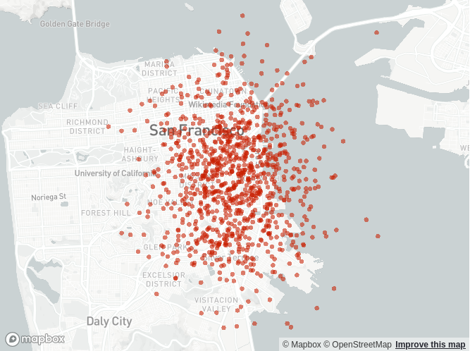
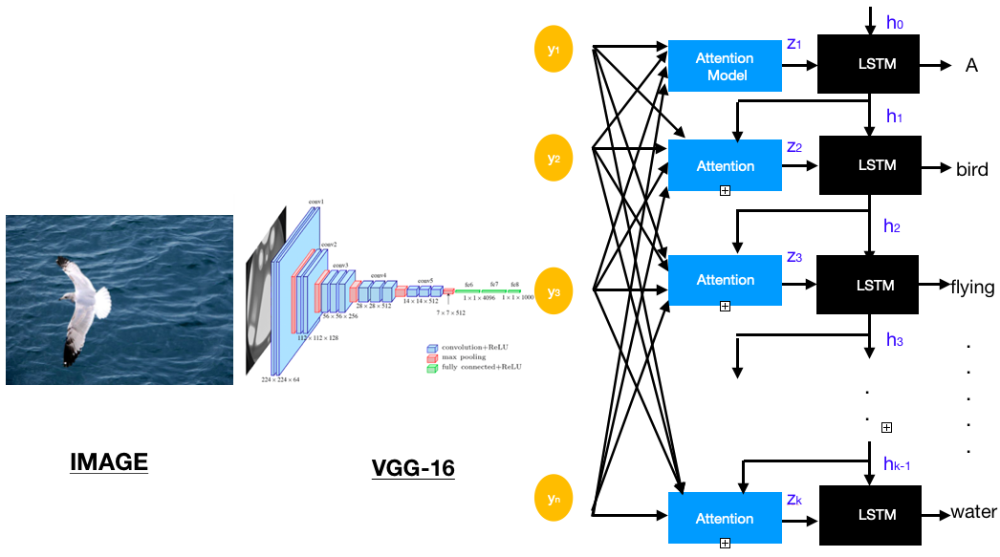
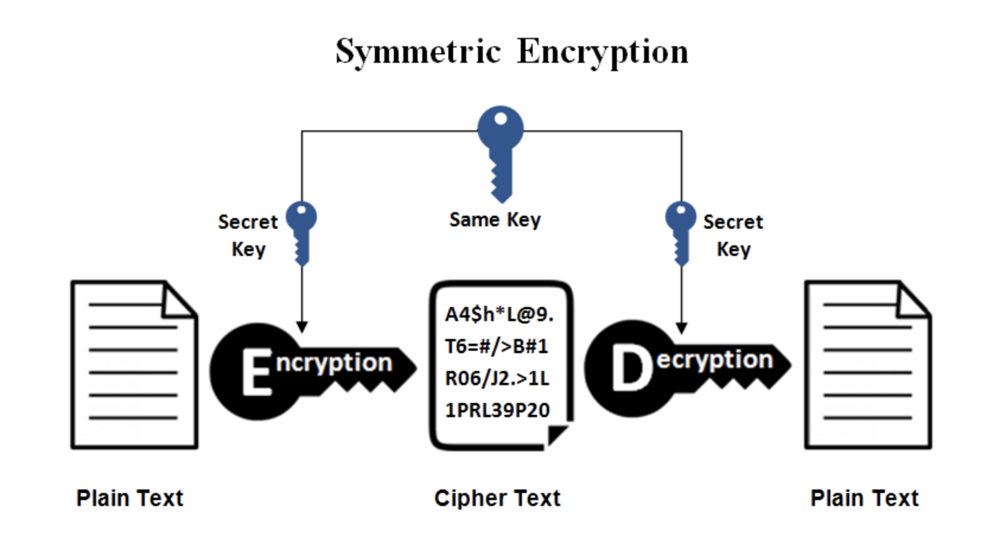

# capbot-siic
Repository to hold code for the [cap-bot](https://github.com/aryankargwal/cap-bot) varient that is being presented at the SIIC Defence Hackathon 2021.
 

## Problem Inspiration 
 
A plethora of surveillance devices are being used by the Defense Services for supervision and monitoring. However, most of them are manually operated at the cost of enormous amounts of time and manual labour.
 

## Problem Description 
Present state-of-the-art Surveillance Devices require both consistent manual assistance and time for their successful operation. This results in a considerable loss of manual and technical resources.
 

## Proposed Solution 
We propose a Deep Learning Application that will be able to solve the above mentioned problems. 
- Our application named ‘Cap-Bot’ is capable of running Image Captioning on multiple CCTV footages and storing the captions along with the camera number and the time of capture in a convenient log. 
 
- The file of saved captions can then be used to look up for incidents from any instant of time just by entering a few keywords.  The returned camera number and time slot can then be used to obtain the required CCTV footage. 
 

## Advantages and Features
- Interface to map CCTV Location in a defined area and eventually help single out points of interest. 
 
- Since our model relies on Deep Learning, the time can be reduced considerably as we are resorting to an automatic searching operation. 
 
- Since the information is purely textual, the encryption of information is way easier than pictorial. 
 
  
## Steps of Deployment
- [x] Training the Model
- [x] Write the Search Module
- [x] Captioning UI
- [x] Search UI
- [x] Perfecting Search feature 
- [x] Resolving Backend
- [x] Encryption of Generation Captions 
<i>Extra Feature</i>
- [ ] CCTV Localization with results

## Using the deployed version of the web application
Please download the <a href = "https://drive.google.com/drive/folders/10RaV7DTsFVgdYeJZIyveyeJKhfvFiKT2?usp=sharing">Model Checkpoints</a> and move the file to the <a href = "https://github.com/aryankargwal/capbot2.0/tree/main/camera">camera</a> folder.

- Cloning the Repository: 

        git clone https://github.com/aryankargwal/capbot2.0
- Entering the directory for captioning: 

        cd capbot2.0/camera
- Running the captioning web application:

        streamlit run feed.py
- Entering the directory for searching: 

        cd capbot2.0/camera
- Running the searching web application:

        streamlit run search.py
        

## License
This project is under the Apache License. See [LICENSE](LICENSE) for Details.

## Contributors

<table>
<tr align="center">
<td>

Aryan Kargwal

</td>

<td>

Indira Dutta

</td>

<td>

Kunal Mundada

</td>

<td>

Srijarko Roy

</td>
  </table>
</tr>
  </table>

crafted with &hearts; by team <b>Missing-Colon</b>

